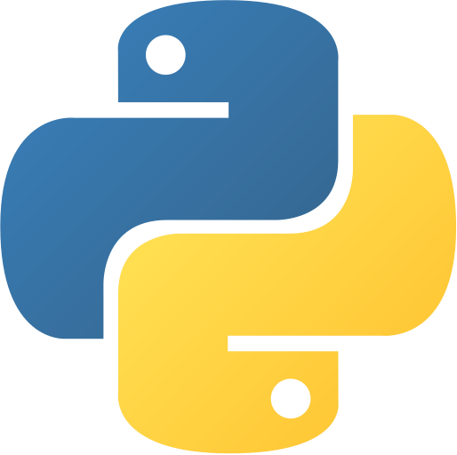
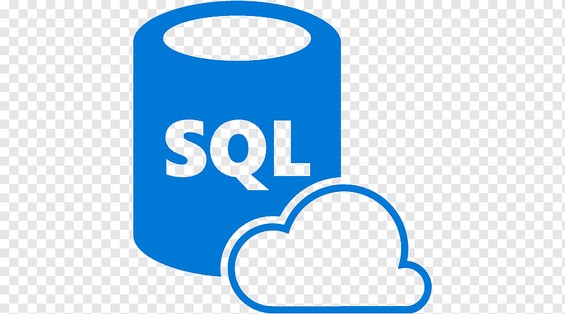
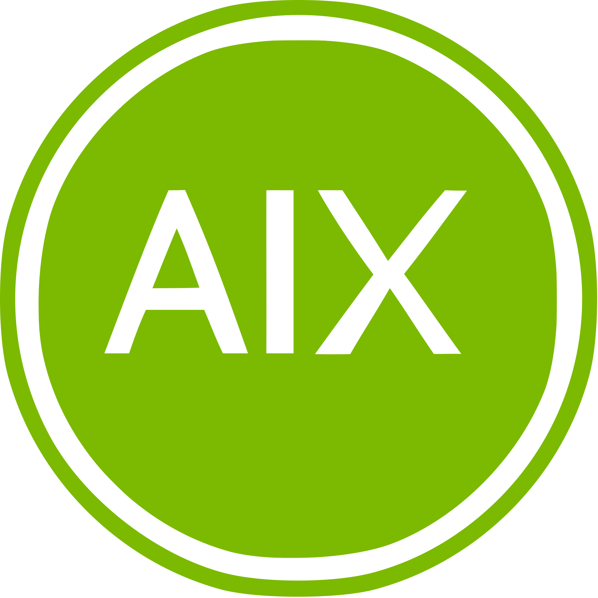

  

***

**Welcome on my Github profile.**

Feel free to take a walk in my **repositories and projects**.

If you have any **suggestion or request**, we can get in touch through **my mail : aymane@aitbenali.com**

## 🎯 2023 Goals

- Create a **blockchain consulting studio**

## 🎯 2024 Goals

- **1000 Commits** on Github
- just enjoy life

## 🏆 Skills

### Programming languages I have experience with:

 

  
  
  &nbsp
  
  

### Operating Systems I can use:

 

  
  &nbsp
  
  &nbsp
  

### I can speak:

Language | Level
-------- | --------
French   | Main language
English  | C1
